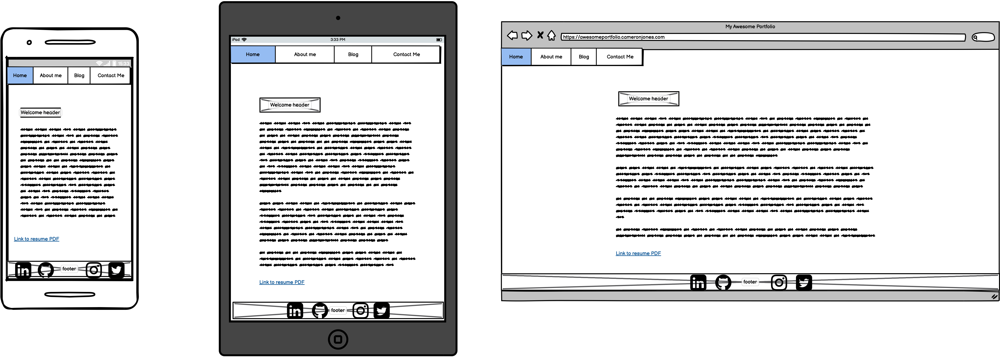
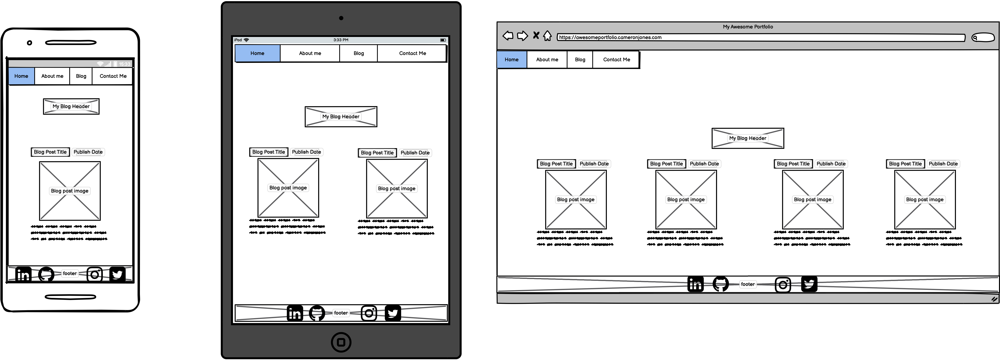

# CameronJones_T1A2
My portfolio website for Coder Academy Term 1 Assessment 2.

[Here is the link to my GitHub repository](https://github.com/iamcrjones/CameronJones_T1A2)

[Link to my deployed portfolio site](https://crjones.netlify.app/)

## Purpose
The purpose of this website is to act as a portfolio to show off my skills and the work I have done to potential employers. This website contains methods of contact, some information about me and also demonstrates my web development skills I have learned so far.

## Features and Functionality

This is the first website that I have made while keeping responsiveness and accessibility in mind throughout the project, making sure it passes audit tests so that it is easily accessible which has helped me improve my site to be stable and loads quickly.

Features of this site include:

* High contrast and careful colour selection for accessibility for people with colour blindness
* Cards with previews of blog posts so user can clearly see how it is divided
* Fully responsive design while also being stable and fast to load

## Components

Many components were designed so that interaction with my portfolio is easy and engaging to use:

* Nav bar allows users to navigate the website and navigate
* Footer with social icons which are used as a means of contact with others
* Cards with previews of blog posts that link to the full article
* Main to contain content styling and keep separate from body content

## Sitemap

## Wireframes

Home:

About:

Blog Posts:

Blog Article:

Contact:

## Target Audience

The target audience for my portfolio is future/potential employers. It allows them to see an overview of my personality, my skills, and what I am capable of and also provides them with means to contact me.

## Screenshots

Mobile: 

Desktop: 

## Lighthouse Scores

Score screenshots: 

## Design & Development

My design and development process started with thinking of the idea of stick with a very minimal and clean design and began to design my initial wireframes.

After my initial wireframes were created, I created and organized the file structure for this project.

I began building the skeleton for most of the pages with html and making sure that I had the core of the content written.

After that I then began to use css mainly just for positioning purposes to get the layout as close to my wireframes as I could.

Next I added my initial colour set and quickly realised that it was too bland, and made my website look extremely dated.

I kept building the html and discovered the use of cards from w3 schools and began to implement my own card divs for my blog page. It was around this time I deployed my website to netlify, and realised there was a few bugs that had to be worked out.

I became stuck on trying to select the colours for my website and had gone through a few different sets. Eventually, I found the base colours that I wanted to use and began to implement them but there was an issue. My main header and nav bar still looked dated, so I decided to scrap the main header and then use my initials for the home part of the navbar instead which made the nav the header in a sense. I then went back and adjusted my wireframes accordingly.

With all of that out of the way, I then began creating my media breakpoints for the responsiveness aspect of the portfolio. Most of the pages were reasonably simple to change in the breakpoints. But the area I had a lot of trouble with was the cards for my blog page. After tinkering with them for a couple of hours, I still had not made any progress. After a break, I then went back and tried removing the anchor tag surrounding the cards and that made things easier.

Even though removing the anchor tag made things easier, the cards were still not working as I intended for them to. A fellow student posted a link to a game designed to teach flex-box, and after completing a few levels I had realised what I was doing wrong and was then able to make the cards responsive.

From there I created the contact form and submit button and then began the finishing touched and making sure I was happy with all aspects of the styling.

## Tech stack

* HTML
* CSS
* Netlify for deployment
* GitHub for version control
* googlefonts for fonts
* balsamiq for wireframes and sitemap
* Blog image sourced from istockphoto.com
* Original social media icons were sourced from each platform's branding page and edited to fit my design

