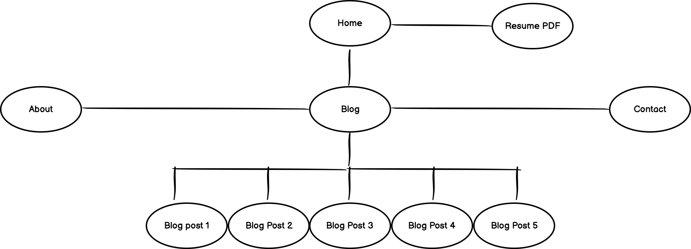

# CameronJones_T1A2
My portfolio website for Coder Academy Term 1 Assessment 2.

[Here is the link to my GitHub repository](https://github.com/iamcrjones/CameronJones_T1A2)

[Link to my deployed portfolio site](https://crjones.netlify.app/)

## Purpose
The purpose of this website is to act as a portfolio to show off my skills and the work I have done to potential employers. This website demonstrates the web development skills I have learned so far.

## Features and Functionality

This is the first website that I have made that keeps the viewer at the forefront, making sure audit tests pass, to ensure accessibility. This has also helped improve load times and site reliability.

Features of this site include:

* High contrast and careful colour selection for accessibility for people with colour blindness
* Cards with previews of blog posts in a clean layout
* Fully responsive design
* Site reliability
* Fast load times
* Resume button for easy download for potential employers
* Multi-page site with intuitive navigation
* Contact links including an email form for direct communication

## Components

I designed this portfolio to be simple and engaging. The components are listed below:

* Nav bar - Allows users to navigate through the pages of the website
* Footer - Contains social media clickable icons
* Cards -  Previews of blog posts that link to the full article
* Main semantic tag - Contains content styling to keep separate from body content

## Sitemap
##### First iteration

##### Final Iteration

## Wireframes

##### Home:

##### About:

##### Blog Posts:

##### Blog Article:

##### Contact:

## Target Audience

This portfolio is designed to attract future employers, as well as showcase the skills I have learned over the past 5 weeks, as well as give an insight to my personality so that they can decide if I am the right fit for their team. 
## Screenshots

Mobile: 

Desktop: 

## Lighthouse Scores

Score screenshots: 

## Design & Development

Before starting any actual coding, I started by deciding on the design for my site. I wanted to keep it minimal so that I could execute everything to the best of my ability. I built wireframes to capture the design. This allowed me to keep my development process within scope.

After my initial wireframes were created, I created and organized the file structure for this project.

I began building the skeleton for most of the pages with html, making sure that I had the core components in place before adding the sprinkles.

After the core structure was completed, I began style my site with css, to position the layout, using my wireframes as reference.

Next I added my initial colour scheme, but realised that it was too bland, and made my website look extremely dated. I then changed the colour scheme to greens, blues, and cream, which fit the aesthetic I was going for a lot better. I reached out to a colourblind friend for feedback, as accessibility was one of my focal points. They informed me that the text was difficult to read on the dark green background I had chosen, so I switched out the colours to make sure all users can browse my site with ease.

I continued building on the html and discovered the use of cards from w3 schools, and due to this I decided to implement my own cards for my blog page. I then deployed my website using netlify, and then began tackling the bugs I found while testing.

In the next iteration of my site, I decided to scrap the original header, as firstly, it still made the portfolio look dated, and it also took up too much screen space on mobile devices. Instead, I used my initials in a button to act as the link back to the homepage. After making these changes, I aligned my wireframes with these changes.

The next step was adding media breakpoints to ensure my site is responsive. This went pretty smoothly, with the exception of the cards for the blog page. I tinkered around with styling these cards for a couple of hours, and ended up removing the anchor tag surrounding the cards.

Removing the anchor tag made things easier, however, the cards were still not working as intended. A fellow student posted a link to a game designed to teach flex-box, and after completing a few levels I had could pin-point what was wrong with the cards, and set off to fix them.

In the last iteration of my portfolio, I created and styled the contact form, and added some finishing touches to ensure I was happy with all aspects of the site. I also updated the sitemap to more accurately depict the different options available, such as navigating back to the home page from each child page, as well as adding the email form from the contact page.

## Tech stack

* HTML
* CSS
* Netlify for deployment
* GitHub for version control
* googlefonts for fonts
* balsamiq for wireframes and sitemap
* Blog image sourced from istockphoto.com
* Original social media icons were sourced from each platform's branding page and edited to fit my design

